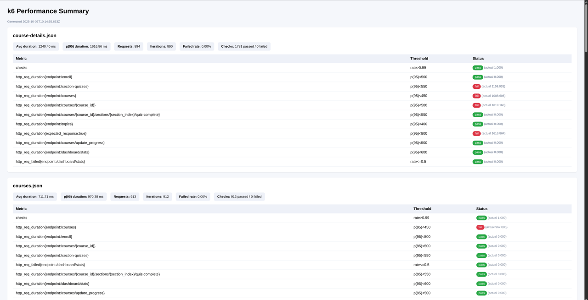

# Polanji Performance Tests (k6)

> k6 scenarios, endpoint tagging, and HTML/DB validation for the Polanji API.

[](https://k6.io)
[](https://www.docker.com/)
[](https://github.com/reevu13/polanji-perf/actions/workflows/performance.yml)

End-to-end performance coverage for the Polanji API. The k6 suite drives individual endpoints, a ramping course-completion workflow, and a PostgreSQL validation step that confirms quiz progress persistence. Every request is tagged so we can track endpoint-specific thresholds and publish HTML summaries with `p(90)`, `p(95)` and `p(99)` trends.

**Topics:** k6 · performance-testing · api · docker · github-actions

## Scope

- Endpoints: `/topics`, `/courses`, `/enroll`, `/courses/update_progress`, `/courses/{course_id}`, `/section-quizzes`, `/courses/{course_id}/sections/{section_index}/quiz-complete`, `/dashboard/stats`
- Workflow: course completion (live IDs passed between steps)
- Profiles: load, stress, spike, soak (selectable via `SCENARIO`)
- Outputs: per-endpoint thresholds, HTML trend report, DB verification, CI artifact

## Prerequisites

| Platform                          | Commands                                                                                                                                                                                                                                                                                                                                                                                                                 |
| --------------------------------- | ------------------------------------------------------------------------------------------------------------------------------------------------------------------------------------------------------------------------------------------------------------------------------------------------------------------------------------------------------------------------------------------------------------------------ |
| Arch / Manjaro                    | `sudo pacman -Syu`<br>`sudo pacman -S k6 git curl jq nodejs npm`                                                                                                                                                                                                                                                                                                                                                         |
| Debian / Ubuntu                   | `sudo apt-get update`<br>`sudo apt-get install -y gnupg2 ca-certificates curl git jq nodejs npm`<br>`curl -fsSL https://dl.k6.io/key.gpg \| sudo gpg --dearmor -o /usr/share/keyrings/k6-archive-keyring.gpg`<br>`echo "deb [signed-by=/usr/share/keyrings/k6-archive-keyring.gpg] https://dl.k6.io/deb stable main" \| sudo tee /etc/apt/sources.list.d/k6.list`<br>`sudo apt-get update && sudo apt-get install -y k6` |
| macOS (Homebrew)                  | `brew update`<br>`brew install k6 node jq git`                                                                                                                                                                                                                                                                                                                                                                           |
| Windows (PowerShell + chocolatey) | `choco install -y git nodejs jq`<br>`choco install -y k6`                                                                                                                                                                                                                                                                                                                                                                |

## Running the test suite

Export credentials once per shell session:

```bash
export BASE_URL=https://api.polanji.com
export EMAIL=<your_user_email>
export PASSWORD=<your_password>
```

### Scenarios

The workflow script (`tests/workflows/courseCompletion.workflow.js`) executes the full journey – login → browse courses → enroll → update progress → complete a quiz. `k6.options.js` defines four arrival-rate presets tailored for that flow. Select the profile with `SCENARIO` (default `load`). Valid values: `load`, `stress`, `spike`, `soak`.

```bash
SCENARIO=load k6 run tests/workflows/courseCompletion.workflow.js
SCENARIO=stress k6 run tests/workflows/courseCompletion.workflow.js
SCENARIO=spike k6 run tests/workflows/courseCompletion.workflow.js
SCENARIO=soak k6 run tests/workflows/courseCompletion.workflow.js

# run all profiles in sequence
for s in load stress spike soak; do SCENARIO=$s k6 run tests/workflows/courseCompletion.workflow.js; done
```

> Avoid mixing `--vus`, `--duration`, or `--stage` with scenarios—these legacy flags override the scenario configuration entirely and will raise a warning.

### Individual endpoint commands

Run any endpoint smoke test with a scenario (default `load`):

```bash
SCENARIO=load k6 run tests/endpoints/topics.test.js                # GET /topics
SCENARIO=load k6 run tests/endpoints/courses.test.js               # GET /courses
SCENARIO=load k6 run tests/endpoints/enroll.test.js                # POST /enroll
SCENARIO=load k6 run tests/endpoints/progress.test.js              # PUT /courses/update_progress
SCENARIO=load k6 run tests/endpoints/quizComplete.test.js          # POST /courses/{course_id}/sections/{section_index}/quiz-complete
```

### Run every script

- **Bash loop** – `find tests -maxdepth 2 -type f \( -name '*.test.js' -o -name '*.workflow.js' \) | sort | while read file; do SCENARIO=load k6 run "$file"; done`
- **Wrapper** – `scripts/run-all-tests.sh [k6 options]`
- **Full suite + DB validation + HTML report** – `scripts/run-full-suite.sh` (executes the workflow under load, stress, spike, and soak scenarios sequentially, then runs the endpoint smokes)

## Database validation

```bash
export PGHOST=<your_db_host>
export PGDATABASE=<your_db_name>
export PGUSER=<your_db_user>
export PGPASSWORD=<your_db_password>
# Optional TLS configuration
# export DB_SSL=true
# export DB_SSL_STRICT=true
EMAIL=<your_user_email> node scripts/db-validate.js
```

`PGHOST`, `PGDATABASE`, `PGUSER`, and `PGPASSWORD` are required. The runner stores JSON summaries under `artifacts/summaries/` and converts them into `artifacts/summary-report.html`; open that HTML file in a browser to inspect latency, failure rate, and threshold outcomes (including actual `p(90)`, `p(95)`, `p(99)`). Set `ARTIFACT_DIR`, `SUMMARY_DIR`, or `REPORT_HTML` before invoking `scripts/run-full-suite.sh` to change output paths. Even if database validation fails, the summary report is still generated and uploaded as part of the workflow artifact. The validator confirms:

- `topics`/`courses` tables contain data.
- The test user exists and has a fresh enrollment.
- Course progress and quiz completion are persisted in Postgres.
- Section quizzes exist for the exercised course.

## Manual JSON export

```bash
SCENARIO=load k6 run --summary-export out.json tests/workflows/courseCompletion.workflow.js
jq . out.json | less
```

## Dockerized execution

```bash
docker build -t polanji-perf .
docker run --rm \
  -e BASE_URL=https://api.polanji.com \
  -e EMAIL=<your_user_email> \
  -e PASSWORD=<your_password> \
  -e PGHOST=<your_db_host> \
  -e PGDATABASE=<your_db_name> \
  -e PGUSER=<your_db_user> \
  -e PGPASSWORD=<your_db_password> \
  -e SCENARIO=load \
  -v "$(pwd)/artifacts:/app/artifacts" \
  polanji-perf
```

Mounting `artifacts/` keeps the HTML report and JSON summaries after the container exits.

## CI/CD (GitHub Actions)

Secrets required: `PERF_BASE_URL`, `PERF_EMAIL`, `PERF_PASSWORD`, `PERF_DB_HOST`, `PERF_DB_NAME`, `PERF_DB_USER`, `PERF_DB_PASSWORD`.

The workflow mirrors the local Docker command, publishes `artifacts/summary-report.html`, and fails only if DB validation fails or a threshold is breached. Download the artifact from the Actions UI to review the latest report.

## Documentation

- [Architecture & data flow](docs/architecture.md)
- [Sample HTML report](docs/sample-report.html)
- Sample HTML summary preview:

  

## Linting & formatting

```bash
npm install
npm run lint
npm run format
```

`.env.example` documents the environment variables expected by the suite.

## License

Released under the [MIT License](LICENSE).
