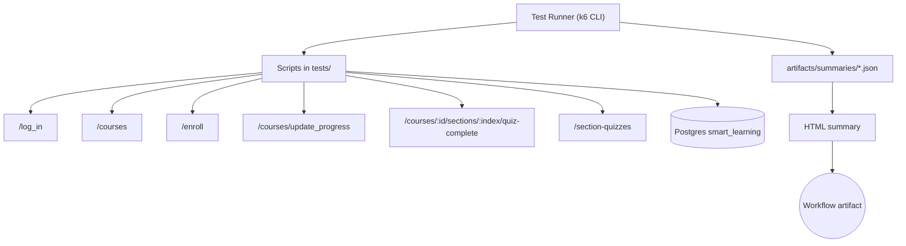

# Performance Test Architecture

**Flow summary**

1. `scripts/run-full-suite.sh` logs in, executes all endpoint scripts, and the workflow scenario under a shared ramping-arrival-rate executor.
2. Every HTTP request is tagged with the canonical endpoint name, enabling per-route thresholds and cleaner reports.
3. k6 emits JSON trend summaries (`min`, `avg`, `p(90)`, `p(95)`, `p(99)`, `max`) for each scenario.
4. `scripts/render-report.js` converts those JSON files into `artifacts/summary-report.html` with threshold badges and actual values.
5. `scripts/db-validate.js` cross-checks the latest quiz completion against the `course_interactions`, `course_section_quiz_progress`, and `section_quizzes` tables.
6. GitHub Actions builds the Docker image, runs the suite, uploads the `artifacts/` folder, and exposes `summary-report.html` for download.
